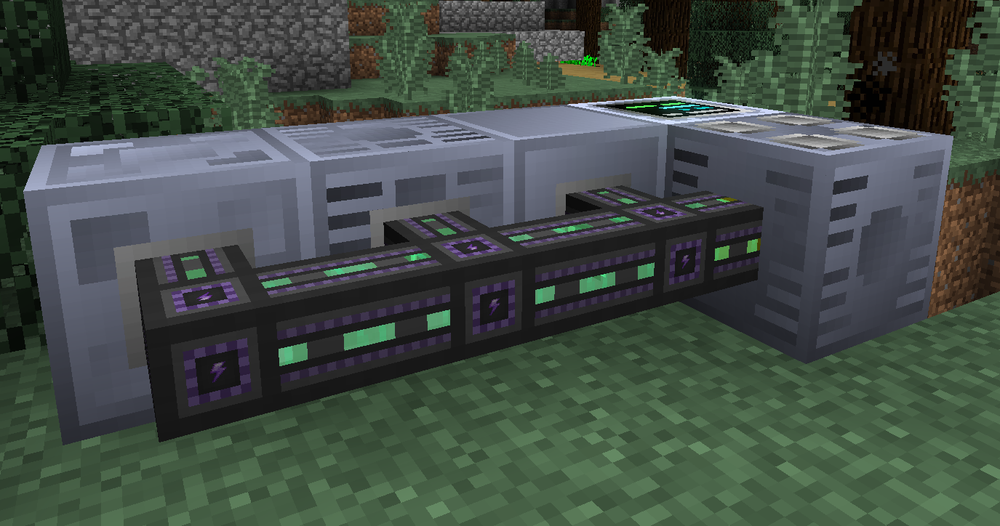

# Gregfluxology

*“做出了一个违背祖宗的决定”*

*"I had made a decision against my ancestors‘ will"*

## What is this?

:trollface:

Gregfluxology is a updated version of [Gregic Power](https://gitlab.com/DBotThePony/gregtech-fe) made by DBotThePony, which adds native duplex support of Forge Energy to GTCEu machinery.

## Responses

    <i>"I can't stand cults."</i>

    —— 玄衣

 

    <i>"The voltage doesn't exist anymore."</i>

    —— UMRU

 

    <i>"The mafia is after you now for your crimes. Your crimes surpass the constraints of law"</i>

    —— iris(@iristhepianist)

## Bug

Yes this is almost certainly to be buggy 'cause I can't code. Feel free to open issues. (P.S. I cen't spall aithar.)

## Credit
- [DBotThePony](https://gitlab.com/DBotThePony) for making the original Gregic Power mod
- [GregTechCEu Team](https://github.com/GregTechCEu) for buildscripts